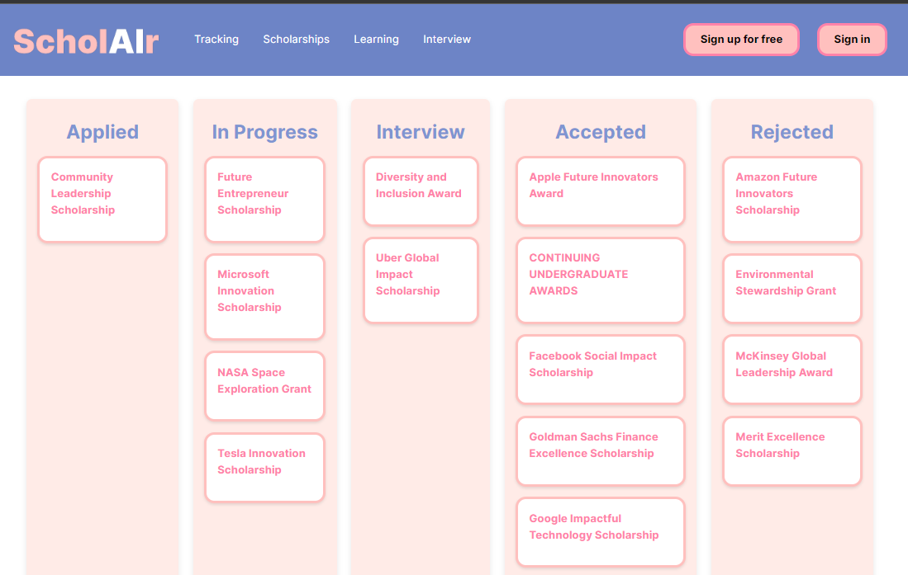
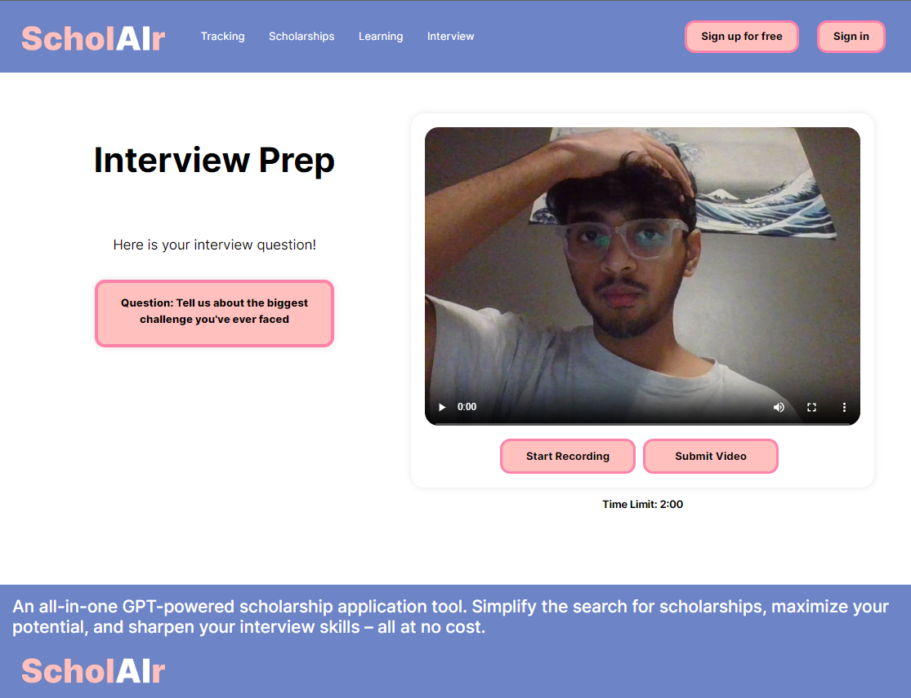
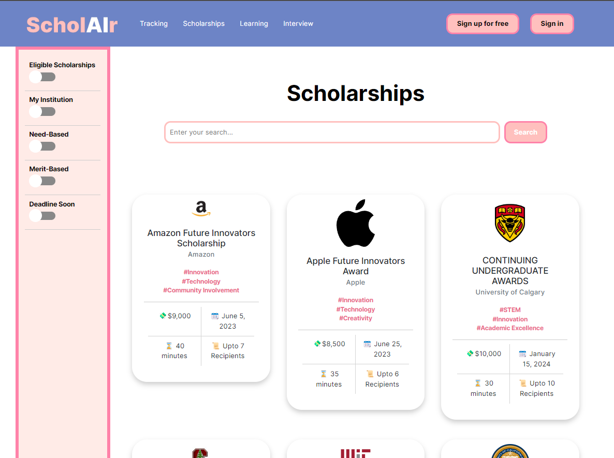
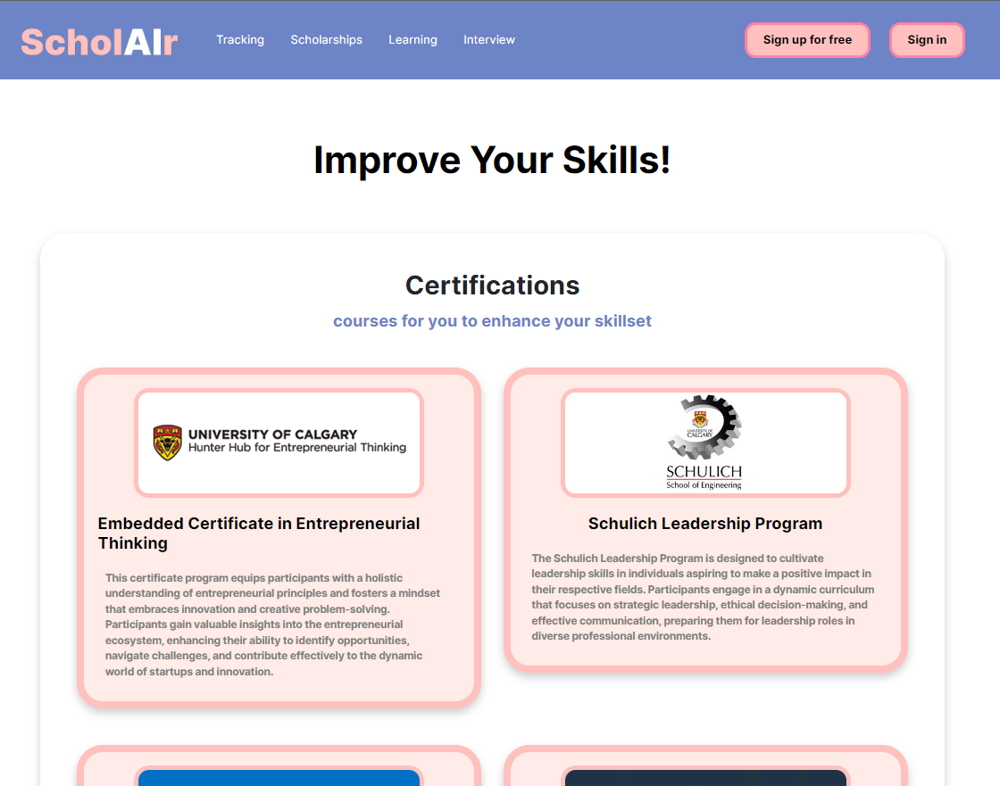

# ****ScholAIr (AI-powered Scholarship Application Tool)****
## 2nd Place Winner - Hunter Hub Hackathon 2023, University of Calgary

  

## Team 405 Found
- Abhay Sharma
- Chirag Asrani
- Sarthak Sharan
- Zeeshan Chougle
- Atharva Naik

## Description
An all-in-one AI-powered Scholarship application tool. Simplify the search for scholarships, maximize your potential, and sharpen your interview skills. This app includes features like - Intuitive Application Tracking, Profile auto-enhancement, Application auto-enhancement, GPT-powered Mock Interview Prep, as well as Personalized scholarships and resource recommendations.

### Intuitive Application Tracking
Easy tracking of all the scholarships.

  

### Application Auto-Enhancement
Allows for GPT-powered enhancement of your answers to scholarship questions, based on your profile. 

  

### Mock Interview Prep
Helps prepare for interviews by asking common scholarship interview questions, and giving feedback on your answers using GPT-4, using your profile as the context.

  

### Personalized Scholarships
Scholarships page where you can search for Institution-specific scholarships, that contains Scholarship cards consisting of relevant information including the scholarship amount, no. of recipients, time the application takes, and deadline for the scholarship application, along with the relevant tags for each scholarship.

  

### Personalized Resource recommendations
Suggests Resources such as online courses or hackathons to help boost your profile.

  

